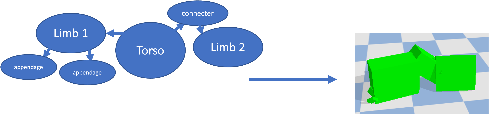
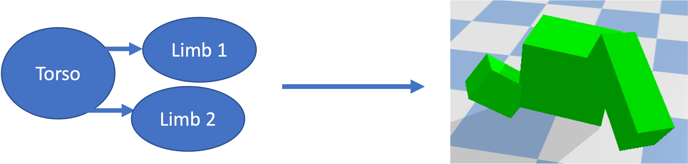

# Virtual Creature Evolution

Evolve virtual creatures from nothing. Create order from disorder, harmony from entropy.

Made using [pybullet](https://pybullet.org/wordpress/index.php/forum-2/), extending [pyrosim](https://github.com/jbongard/pyrosim).

# Explainer Video

[Link:](https://youtube.com)

# Running the Code

First, install dependencies. Run `pip3 install -r requirements.txt`

#### To view evolved creatures:

1. Now simulate best creatures from within the `saved_data` folder. The populations are saved within the `populations` subfolder within every epoch folder (an epoch is an round of independent evolution). So, to run the best robot at the 500th generation of the 7th epoch, edit the open file to read `saved_data/epoch7/populations/population_gen500.p`.
2. Run the simulation file: `python3 rerunpopulation.py`

#### To evolve your own creatures:

1. Run the following command: `python3 search.py`.
2. You can change the number of generations and the population size in the `constants.py` file.
3. If you don't want to overwrite your previous creatures, move or rename the epoch folders the `saved_data` folder.

# Methods

### The Genotype

These virtual creatures are stored using a **graph-based genotype**. Nodes represent a body part and edges represent a joint between body parts.

Each node and edge holds physical information about it, including `length`, `width`, and `height`, for body part dimentions and `length_proportion`, `width_proportion`, `height_proportion` for where on a body part a joint should connect.

Nodes also have the `neuron_weights` attribute which is the brain of robot. This holds the weights of this body part's portion of the brain. The robot's brain is a **1-layer fully-connected neural network**, meaning every sensor is connected to every joint:

The construction of these genotypes can be further inspected in `randomgenotype.py`.

### Selection Algorithm

Every generation consists of a population of creatures. Only the most fit creatures survive to the next generation, replacing their parents and siblings. For demo purposes, the fitness function was simply the x dimention of the creatures, encouraging them to evolve for forward locomotion. This function can be changed in the `Get_Fitness()` function of `robot.py` to change what the creatures are evolving to optimize.

This simulation uses a **sweeping algorithm** to determine which creatures will survive. In other words "the best so far" will be chosen to survive. If a later creature is inspected and has a higher fitness than previous creatures, it will take the remaining spots until a creature with a higher fitness is found. This algorithm balances choosing diverse creatures and the most fit creatures (the **"explore-exploit"** problem).

The selection algorithm can be seen in the `Select()` function within the `parallelHillClimber.py` file.

### Mutation Process

Every generation the new parents are mutated slightly. For numeric values such as the `length` of a body part or `width_proportion` of a joint, there is a small chance the value is randomly increased or decreased slightly. For boolean values such as `has_sensor`, there is a small chance the value is flipped.

Body parts can also be added or removed. Added body parts are always very small to mimic how limbs grow in real creatures. Body parts can only be removed if they are leaves in the graph representation of the genotype. This preserves the virtual creature's structural integrity.

The code for the mutation process can be found in the `Mutate()` function within `solution.py`.

# Results

Using the aforementioned methods, an incredible diversity of creatures were evolved from completely random genotypes.

### There were many hoppers, some side-swipers, and even a biped:

  
  
  
  
  
  
  
  
  
  <!--  -->

The prevelance of hoppers is likely due to a limitation in the simulation: this simulation only supports joints which rotate in 1 dimention. This makes it easier for creatures to move forward, and more difficult for creatures to evolve more complex locomotion strategies.

### There was also one "dud," a creature which did not evolve very well for locomotion.

This is an example of a creature finding a local maximum within the fitness landscape and being unable to escape. This creature developed a strategy of very quickly moving its front body parts to vibrate forward. The vibration method of locomotion is very fragile; if any small changes are made such as elongating a limb or changing a few neural weights, they are more likely to send the robot flailing rather than being a useful change.

fitness_landscape.png

### Fitness Graphs

The following is a plot of the fitness of the most fit creature of an evolutionary epoch for every generation.

Creatures' fitness progress as one might expect:

1. Fitnesses are initially low.
2. They then improve very quickly as obviously innefective creatures are discarded and the simplest improvements are found.
3. Then, improvement is sparse, taking much longer to find and often coming in large bursts.

#### Some Observations:

- **Some evolutionary runs have likely plateaued**, not improving their fitness for many generations, such as the dark blue and light blue runs.
- **Some evolutionary runs are seen to make large improvements near the 500th generation**, such as the ones represented in the gray and red lines. These runs likely **could have achieved a higher fitness** if they were run for more generations.
- **The fitness of the initial population of creatures is not a determining factor of the success of the evolutionary run.** The dark blue run can be seen to start with the lowest fitness, yet achieves the highest fitness at the end of the evolutionary simulation. Conversely, the light blue run started with one of the highest fitnesses, but ended with one of the lowest. **We can then infer that it is another part of these creatures' morphology, mutation or selection processes which creates fit robots.**

### Lineage

The following are the lineages of some robots within the `saved_data` folder, showing the creatures evolved.

IMAGES: 2, 4, 8

It can be seen here that the **body plans of creatures are mostly determined within the first 50 or 100 generations of evolution**. After that, only small changes are made to the body; **major improvements then come from optimizing the brain**.

This is likely due to the fact that **the environment these creatures inhabit doesn't change**. If a creature finds a viable method to move forward, there are no large incentives for it to evolve further other than the implicit competition of its parents and siblings.
